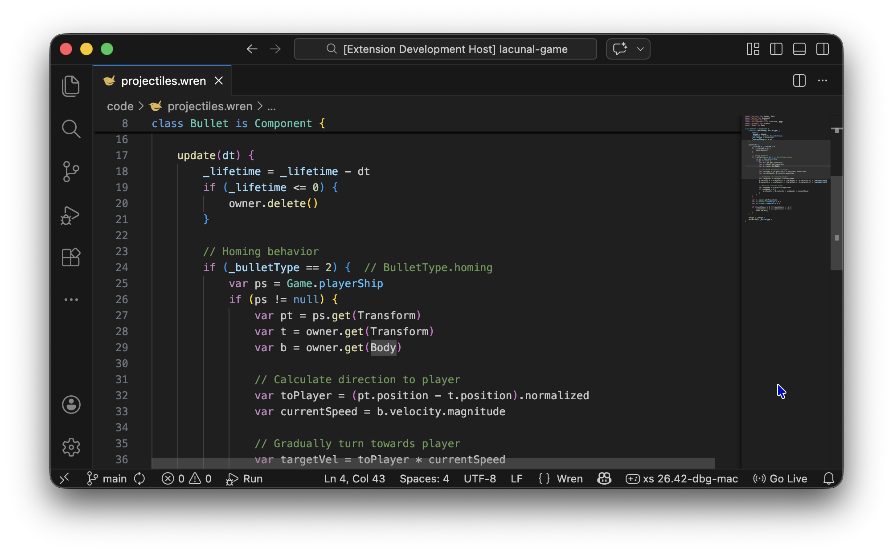
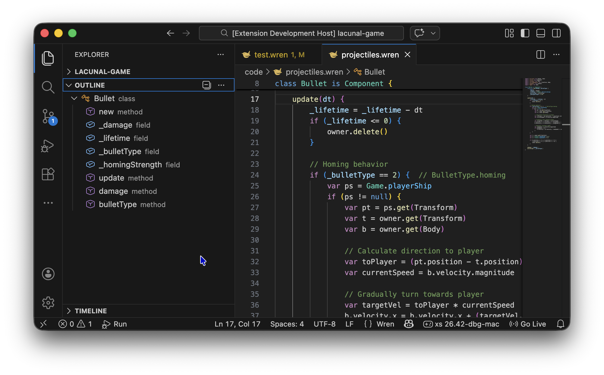
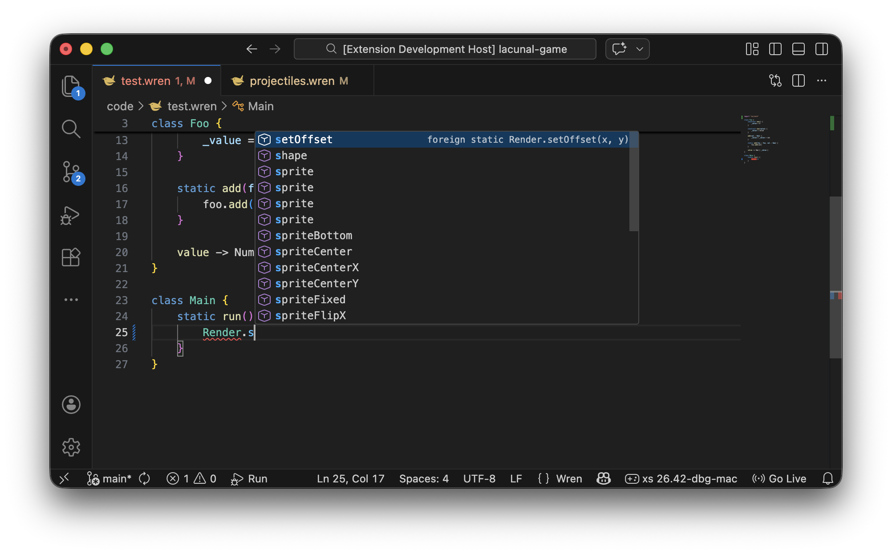
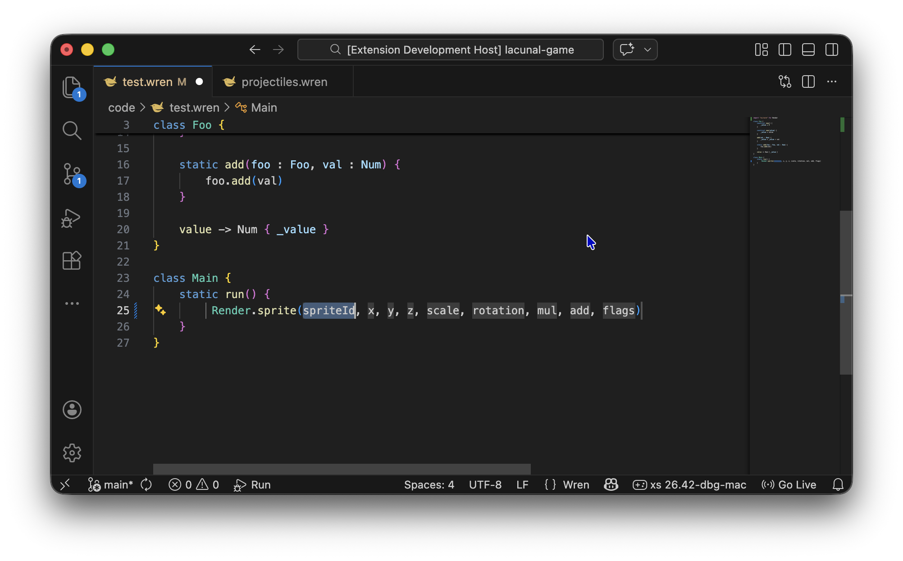
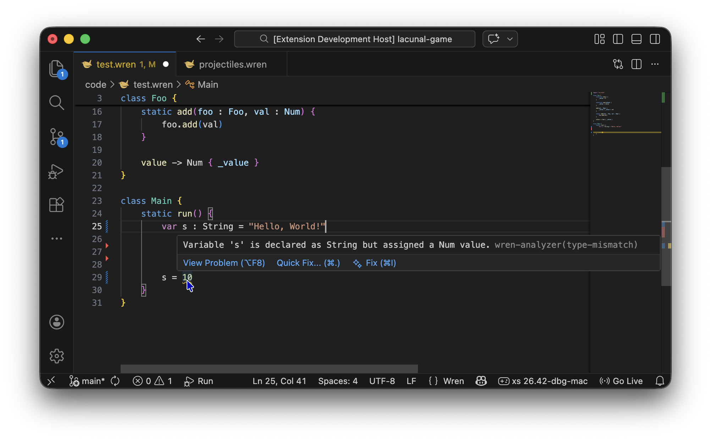
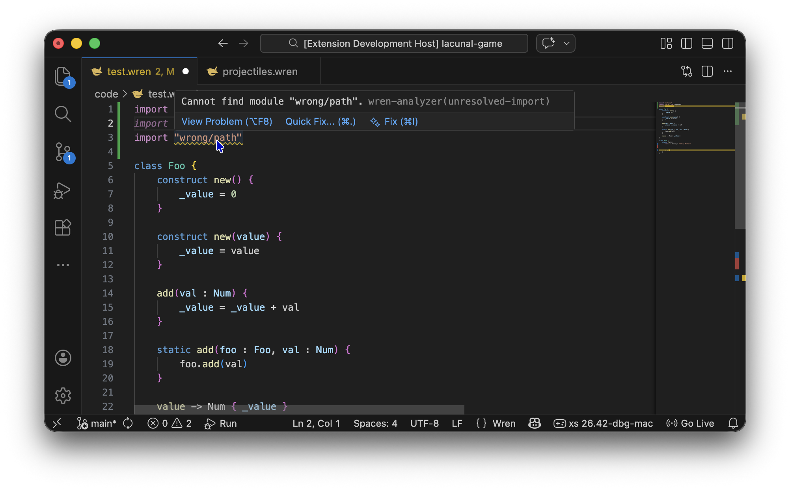

# Wren Language Extension

Visual Studio Code extension for the <a href="https://wren.io">Wren</a> programming language.

## Features:

### Syntax Highlighting

Syntax highlighting for Wren 0.4 (latest)

### Document Outline & Symbols

Navigate your code with the outline panel. Classes, methods, constructors, subscript operators, and fields (collected from the methods) are listed hierarchically.

### Code Completion

Context-aware autocompletion:

- **Keywords** — `class`, `construct`, `import`, `var`, …
- **Class names** — all classes in the current file, imported modules, and the Wren library
- **Static members** — type `List.` to see `new()`, `filled()`, etc.
- **Instance methods** — type `value.` to see all known instance methods and properties (requires [type-annotations])
- **Constructors** — `Fiber.new`, `Foo.new`, …

### Signature Help

Inline parameter hints appear as you type inside parentheses, showing all overloads with their parameter names.

### Diagnostics

Real-time error and warning squiggles powered by an analysis pipeline (lexer → parser → resolver → (optional) type-checker). Catches syntax errors, unresolved variables, and type annotation warnings as you type.

### Import Resolution

The extension follows `import` statements to discover classes across your project. It understands:

- Relative imports (`import "utils"`)
- Selective imports (`import "utils" for Helper, Config`)
- Configurable search paths via `wren.additionalModuleDirectories`
- Unresolved import warnings with squiggles on the import path or the class names when using selective imports 

### File Icons

Last but not least, two custom file icons for `.wren` sources in both light and dark themes.  

---

## Configuration

### `wren.enableDiagnostics`

Enable or disable analyzer diagnostics (type mismatches, unknown methods, wrong arity, unresolved imports). Default: `true`. Parse errors are always shown regardless of this setting.

### `wren.additionalModuleDirectories`

An array of directories to search when resolving `import` statements.

- **Relative paths** are resolved per workspace folder
- **Absolute paths** work as-is (useful in global user settings for engine/framework modules)

---

## Acknowledgements

Analysis powered by [wren-analyzer](https://github.com/enci/wren-analyzer), a TypeScript port of [wrenalyzer](https://github.com/munificent/wrenalyzer) by Bob Nystrom, extended with optional type-checking support.

Based on the Wren extensions by Johann Muszynski and Mike Rubits.

[type-annotations]:https://github.com/enci/wren